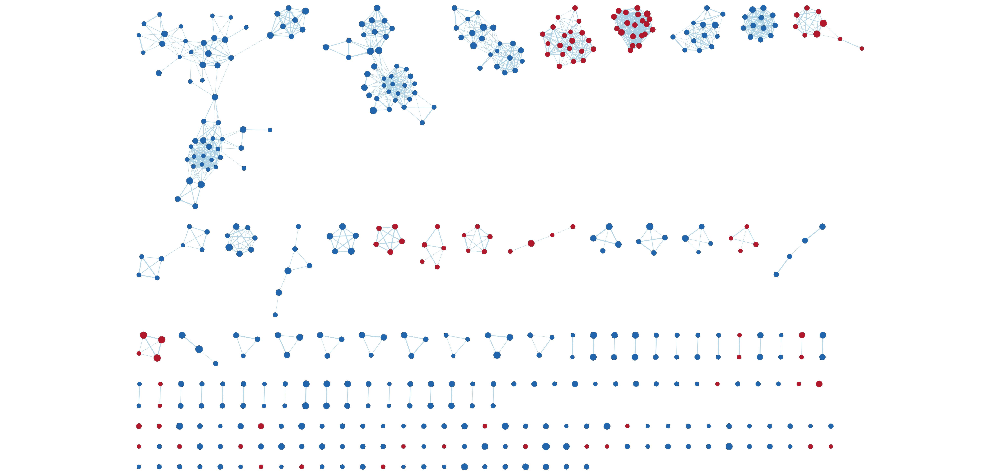
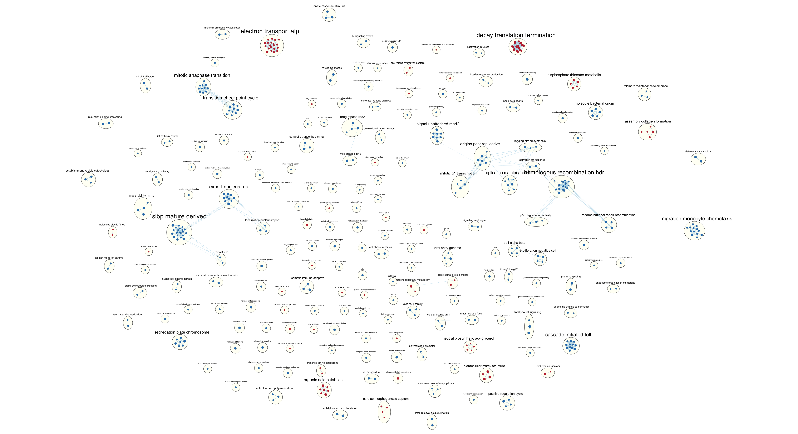
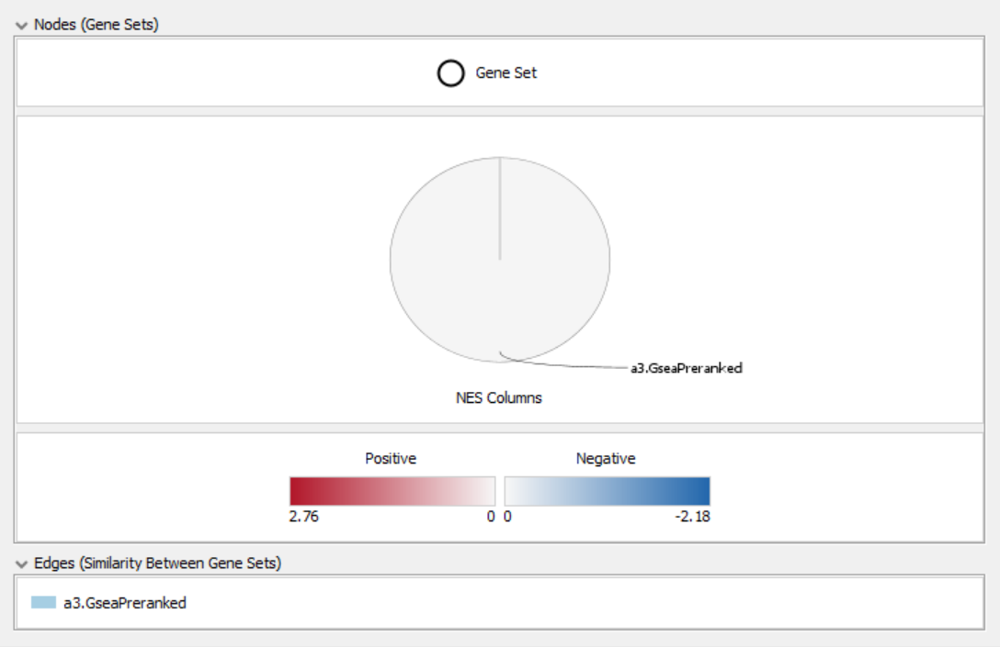
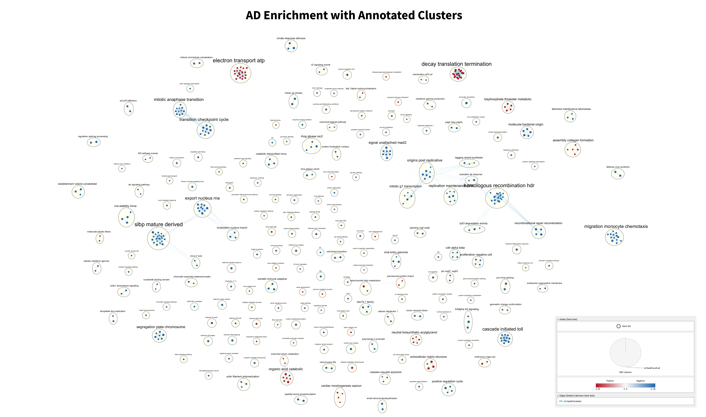
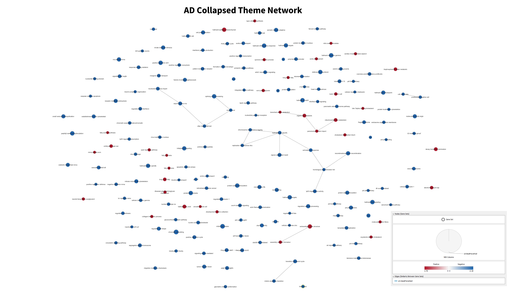
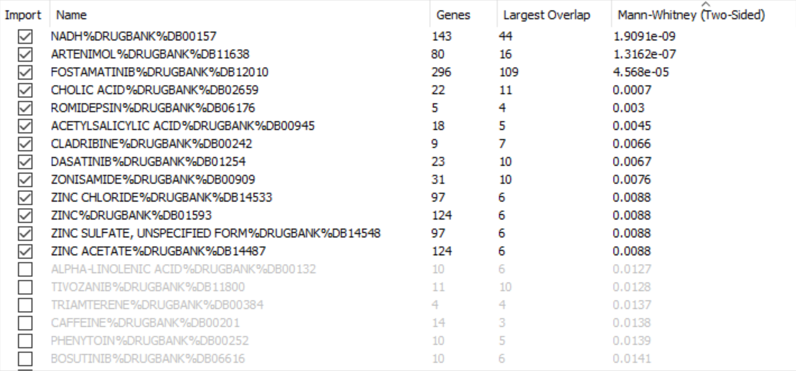
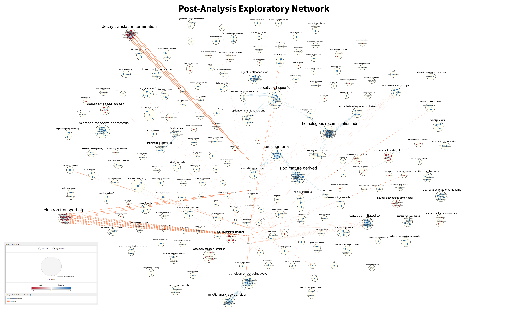
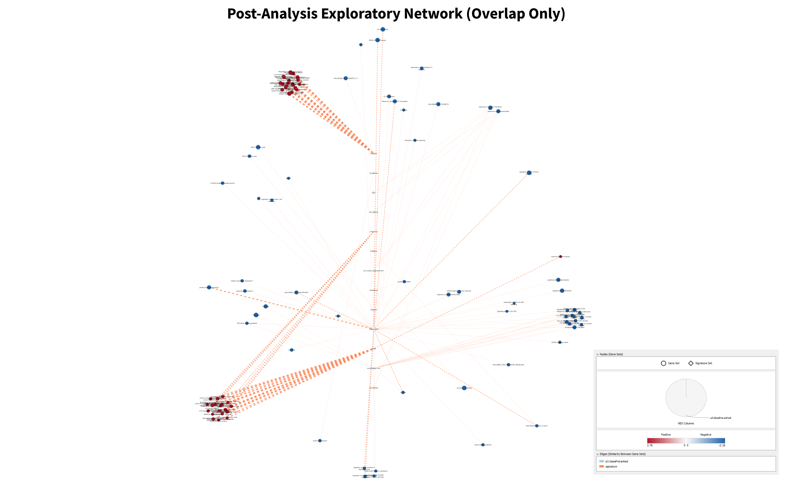

```{r, message = FALSE, warning = FALSE, include = FALSE}
# Setup: several R packages are required to run this notebook. They can be installed by running this snippet (the code
# will not be included in the final report).

if (!requireNamespace("BiocManager", quietly = TRUE)) {
  install.packages("BiocManager")
}
if (!requireNamespace("knitr", quietly = TRUE)) {
  install.packages("knitr")
}
if (!requireNamespace("RCurl", quietly = TRUE)) {
  install.packages("RCurl")
}
```

## 1. Introduction

This notebook contains a pathway and network analysis for the set of ranked genes obtained from the GEO dataset
[GSE157194](https://www.ncbi.nlm.nih.gov/geo/query/acc.cgi?acc=GSE157194), associated with the publication "Atopic
dermatitis displays stable and dynamic skin transcriptome signatures" [@mobus]. The goal of the study was to understand
the effects of the drugs dupilumab and cyclosporine on atopic dermatitis (AD) by conducting a gene expression study
using mRNA-seq data taken from biopsies of human patients.

The raw count matrix was first downloaded via GEOquery [@geoquery], and the data was cleaned to confirm that no
duplicates were present. Next, the data was then filtered by gene, removing those without at least one read per million
in each sample, and also by patient, removing those with incomplete data. Ensembl IDs were mapped to HUGO gene symbols
using biomaRt [@biomart], and genes that were unable to be converted (e.g., novel genes) were removed. To normalize the
data, trimmed mean of m-values was used [@edger], since the assumption was that most genes were not differentially
expressed. See [this report](https://github.com/bcb420-2022/Yijia_Chen/blob/main/A1.nb.html) for more details on the
dataset, its cleaning, and its normalization.

The obtained list of genes was next used to perform a differential gene expression analysis using a quasi-likelihood
model [@edger], and the resulting p-values for each gene were converted to rank (using the formula
$\text{-}\hspace{-0.6mm}\log_{10}(p\text{-}value) \times \text{sign}(logFC)$). The resulting set of ranked genes was
then sorted by descending rank and written to the file rankedGeneList.rnk, which will be the starting point for GSEA.
See [this report](https://github.com/bcb420-2022/Yijia_Chen/blob/main/A2_YijiaChen.nb.html) for more details on the
gene expression analysis (and additional over-representation analysis).

The corresponding journal entry for this notebook can be found
[here](https://github.com/bcb420-2022/Yijia_Chen/wiki/10.-Assignment-3-%E2%80%90-Dataset-pathway-and-network-analysis).
We can begin by taking a look at the top and bottom of the list of ranked genes to get an idea of what the table looks
like:

``` {r, message = FALSE, warning = FALSE}
# Make sure the rank file exists
rankFile <- file.path(getwd(), "rankedGeneList.rnk")
if (!file.exists(rankFile)) {
  stop("Rank file not found")
}

rankList <- read.table(file = rankFile,
                       sep = "\t",
                       header = TRUE,
                       stringsAsFactors = FALSE,
                       check.names = FALSE)
knitr::kable(rankList[1:5, ], type = "html")
```

<center>
Table 1. The first five genes in the ranked gene list.
</center>

``` {r, message = FALSE, warning = FALSE}
stopIdx <- nrow(rankList)
startIdx <- stopIdx - 5
knitr::kable(rankList[startIdx:stopIdx, ], type = "html")
```

<center>
Table 2. The last five genes in the ranked gene list.
</center>

## 2. Non-Thresholded Gene Set Enrichment Analysis (GSEA)

The GSEA pre-ranked method will be used for analysis [@gsea1] [@gsea2] (version 4.2.3, run locally, with the results
presented here).

First, we will need a gene set file for the analysis. For this, we can download one provided by the Bader Lab [@bader]
(see http://download.baderlab.org/EM_Genesets). These sets contain many sources (see the list
[here](http://baderlab.org/GeneSets)) and are updated regularly (monthly), so are ideal for this task. In particular,
we will choose one for human genes, contains all GO:BP pathways (since we are mostly focused on pathways), and excludes
inferred electronic annotations (since we want our analysis to be more specific or curated). As of the time of writing,
the most updated version of the file that satisfies these criteria is from April 1, 2022, so this will be the version
downloaded and used here (Human_GOBP_AllPathways_no_GO_iea_April_01_2022_symbol.gmt).

``` {r, message = FALSE, warning = FALSE, results = "hide"}
# Get a list of all the available gene set files
gsUrl <- "http://download.baderlab.org/EM_Genesets/current_release/Human/symbol/"
files <- RCurl::getURL(gsUrl)
conn <- textConnection(files)
contents <- readLines(conn)
close(conn)

# Find the GMT file with all GO:BP pathways and no electronic annotations
regex <- gregexpr("(?<=<a href=\")(.*.GOBP_AllPathways_no_GO_iea.*.)(.gmt)(?=\">)", contents, perl = TRUE)
gmt <- unlist(regmatches(contents, regex))

# Download the file if it has not been downloaded already
# Warning: it may download a more up-to-date gene set; if doing comparisons or trying to reproduce results, make sure
# to check the version number
gmtFile <- file.path(getwd(), gmt)
if (!file.exists(gmtFile)) {
  download.file(paste(gsUrl, gmt, sep = ""), destfile = gmtFile)
}
```

The GSEA settings used were as follows:  
Number of permutations: 1000  
Collapse/Remap to gene symbols: No_Collapse  
Enrichment statistic: weighted  
Max size: 200  
Min size: 15

Some explanations for using these parameters can be found
[here](https://github.com/bcb420-2022/Yijia_Chen/wiki/09.-GSEA).

### Summary of Results

The dataset has 17,747 genes, all of which were used in the analysis. The gene set had 18,536 genes, but after applying
the minimum and maximum size filters, the number was reduced to 5,591 (a reduction of 12,945 sets).

For the upregulated sets:

* 1,186 gene sets were found to be upregulated (of the 5,591)
* 350 sets were significant at FDR < 0.25
* 338 sets were significantly enriched with p-value < 0.05
* 191 sets were significantly enriched with p-value < 0.01
* The top set was "PEPTIDE CHAIN ELONGATION%REACTOME DATABASE ID RELEASE 79%156902" with the following details:
  * Enrichment score of 0.75145817
  * Normalized enrichment score of 2.7556887
  * p-value of 0.0
  * FDR of 0.0
  * Leading edge set has size 71
  * Top gene is RPS18
  
For the downregulated sets:

* 4,405 gene sets were found to be downregulated
* 2,053 sets were significant at FDR < 0.25
* 1,506 sets were significantly enriched with p-value < 0.05
* 824 sets were significantly enriched with p-value < 0.01
* The top set was "HALLMARK_E2F_TARGETS%MSIGDB_C2%HALLMARK_E2F_TARGETS" with the following details:
  * Enrichment score of -0.6646858
  * Normalized enrichment score of -2.1820378
  * p-value of 0.0
  * FDR of 0.0
  * Leading edge set has size 98
  * Top gene is ESPL1
  
### Comparison to Thresholded Analysis

The idea of comparing these results to the thresholded analysis (TA) (see
[this report](https://github.com/bcb420-2022/Yijia_Chen/blob/main/A2_YijiaChen.nb.html)) is not very straightfoward,
because whereas TA only used genes that were found to be significantly differentially expressed (and it was also
possible to run the analyses separately for up- and down-regulated genes), this non-thresholded analysis (NTA) used
every gene, all at once, regardless of the level of differential expression. However, we can still try to compare the
results, as it may provide some further insight into the observed pathways.

Looking at the upregulated genes, we see that TA found 5,027, 1,007, and 445 pathways, by GO:BP, REAC, and
WikiPathways, respectively, whereas NTA only found 1,186 sets. More specifically, TA's most significant found pathways
were related to metabolic processes (e.g., "long-chain fatty acid metabolic process" and "unsaturated fatty acid
metabolic process"), whereas NTA's most significant sets were somewhat more related to translation (e.g., "VIRAL MRNA
TRANSLATION" and "EUKARYOTIC TRANSLATION ELONGATION"), with metabolic processes slightly further down the list. This
difference could possibly be explained by the issue noted previously; TA only used significantly upregulated genes for
this part of the analysis.

Looking at the downregulated genes, we see that TA found 230, 72, and 52 pathways, by GO:BP, REAC, and WP,
respectively, whereas NTA found 4,405 sets. More specifically, TA's most significant found pathways were related to DNA
replication (e.g., "cell cycle DNA replication" and "DNA-dependent DNA replication"), and NTA's most significant sets
were somewhat similar (e.g., "DNA IR-DAMANGE AND CELLULAR RESPONSE" and "DNA-TEMPLATED DNA REPLICATION"). Overall, it
is possible to say that the compared results are quite similar, and to a degree, agree with each other.

## 3. Visualization of Gene Set Enrichment Analysis (Cytoscape)

To visualize this data as a network, Cytoscape [@cytoscape] will be used (version 3.9.1, run locally) with the
EnrichmentMap [@bader] pipeline (Cytoscape app version 3.3.3). Other included apps are clusterMaker 2 [@clustermaker]
version 2.2, WordCloudd [@wordcloud] version 3.1.4, and AutoAnnotate [@autoannotate] version 1.3.5, all downloaded from
the Cytoscape App Store (via the Cytoscape App Manager).

The GSEA output directory was loaded into EnrichmentMap with the following thresholds (which were recommended by the
EnrichmentMap documentation [here](https://enrichmentmap.readthedocs.io/en/latest/Parameters.html#)):

* FDR cutoff: 0.05
* p-value cutoff: 0.001
* Edge metric: Jaccard+Overlap Combined
* Edge cutoff: 0.5

This produced the following raw image (no manual adjustments or legends, hidden labels):



Figure 1. The initial enrichment map. There are 457 nodes and 1,160 edges.

### Annotation

The next step is to annotate the network with clusters. AutoAnnotate [@autoannotate] with default parameters (plus the
prevention of cluster overlap) was used to annotate the entire network. Some of the key parameters are as follows:

* Cluster options: use the clusterMaker app to define clusters
* Cluster algorithm: MCL Cluster
* Label options: use gene descriptions as the label column
* Label algorithm: WordCloud (adjacent words)
  * Max words per label: 3
  * Minimum word occurrence: 1
  * Adjacent word bonus: 8
  
This produced the following image:



Figure 2. The automatically annotated enrichment map.

We notice that the maps so far are missing legends; it is not immediately clear which colours correspond to which
directions of regulation. We can have the enrichment map automatically generate one, which looks like the following:

<center>
{width=50%}
</center>

Figure 3. The automatically generated legend. Red is for upregulation while blue is for downregulation.

We can then combine the annotated map with the legend (and add a title) to create a "publication-ready" figure:



Figure 4. The complete enrichment map for the analysis, with annotated clusters, legend, and title added.

The map has quite a few significant gene sets, making the text hard to read (because there are so many clusters), so it
may be helpful to open the image separately (perhaps in a new tab) when looking for specific sets or just looking at
the finer details.

Another way to look at the network is to collapse all of the clusters to make a theme network. This may help in
identifying the major themes present, which can further solidify the understanding of relevant pathways, or even to
possibly find novel ones.



Figure 5. The theme network generated by collapsing the enrichment map.

After collapsing the clusters in the enrichment map, we can see several key themes present, including DNA repair/
replication, transcription/translation, metabolism/catabolism, extracellular structure, and cell cycle. All of these
themes agree with the model, and have appeared as top results in previous analyses (like ORA and thresholded analysis).
Many of the gene sets identified are closely related to these overall themes; for example, "DNA REPLICATION", "DNA IR-
DAMAGE AND CELLULAR RESPONSE" (repair), "G1 S TRANSITION" (cell cycle), "EUKARYOTIC TRANSLATION", and "COLLAGEN FIBRIL
ORGANIZATION" (extracellular matrix structure), among others. Among all of these themes and pathways, none were
identified as being novel.

## 4. Interpretation

When comparing the results of the enrichment to the original paper, we see that there are few similarities. The paper
identified several pathways as being enriched, but the first major difference is that the authors found that "all
significantly enriched pathways were *upregulated*" (emphasis mine), whereas here, the majority of enriched pathways
were found to be *downregulated*. The study placed significant focus on pathways and gene sets related to the immune
system, as AD has been thought to be an autoimmune disease, and found many pathways (e.g., the T cell receptor
signalling pathway) to be enriched. In my enrichment, immune-related sets do not dominate; in fact, immunity is not
even present as a significant theme. Instead, the results tend to lean toward more generic pathways. For example, some
of the most significantly enriched (and upregulated) sets were "electron transport atp" and "organic acid catabolic".

However, there are at least some similarities with the original paper. For example, we see some processes related to
DNA repair and replication that have been found to be enriched. Despite the other differences in results, this can
still suggest that AD is directly or indirectly linked to these mechanisms.

Comparisons to the thresholded analysis performed in the previous report have already been discussed (the results
somewhat agree), but we can revisit it anyway. Regarding the number of pathways/gene sets found by each method, we see
that thresholded analysis finds more upregulated pathways and fewer downregulated pathways than enrichment analysis,
but many of the specific sets can be found to be related to each other across analyses. In addition, the network
structures reveal that many of those sets are related to each other, providing further insight into the expression
profile of AD.

Overall, it seems that it is possible and perhaps even likely that I have made some small mistakes in my analyses,
because as I perform more, the results become increasingly divergent from the results of the original paper. After
cleaning and normalizing the dataset, results were fairly in line with the original study, but as the processes began
to build up from each other, results began to differ. For example, after conducting the thresholded over-representation
analysis, I could only conclude that the results were partially supported by the original study. Now after the non-
thresholded analysis, even fewer results can be supported. It would probably be a good idea to revisit each of the
previous steps and try to replicate the study's results.

From the ORA report, we know that [@oka], [@panzer], and [@mansouri] all support the findings of the thresholded
analysis (IL-19, TLR4, and the effects of dupilumab and cyclosporine, respectively) and the original paper, but since
the enrichment analysis does not completely disagree with the study, we can still find additional sources to support
some of the pathways/gene sets. For example, some sets were found to be related to viral DNA replication. A study by
[@wollenberg] found that AD patients may be more vulnerable to specific types of viral infections, and gives a possible
mechanism, related to DNA replication in the patient, as explanation. In addition, the major theme of DNA repair is
supported by [@karaman], which found that "increased chromosome instability [in relation to the DNA repair of AD
patients] may plan an important role in the etiology of AD". So despite my enrichment results not completely agreeing
with [@mobus], the process did find support in other published articles for some other possibly related concepts.

## 5. DrugBank Post-Analysis

The final part of the analysis will be to run a post-analysis on the main enrichment network using DrugBank. We know
from the original study [@mobus] that the drugs dupilumab and cyclosporine can be used to effectively treat AD, which
is additionally supported by [@mansouri] and [@ariens], so it would be appropriate to try running a post-analysis
on the primary enrichment map to determine if it can be verified here.

First, we will download the FDA-approved DrugBank dataset for human use (this GMT file is targeted because we already
know that dupilumab and cyclosporine have been approved for use in treating AD). This can be done in a very similar
fashion as to how the GSEA gene set was downloaded from the Bader Lab previously; the following snippet accomplishes
exactly that. Alternatively, since the post-analysis will be run locally, it can also be downloaded directly from
within Cytoscape by loading the signature gene set from the web.

``` {r, message = FALSE, warning = FALSE, results = "hide"}
# Get a list of all the available gene set files
gsUrl <- "http://download.baderlab.org/EM_Genesets/current_release/Human/symbol/DrugTargets/"
files <- RCurl::getURL(gsUrl)
conn <- textConnection(files)
contents <- readLines(conn)
close(conn)

# Changed the regex to look for "approved" drugs
regex <- gregexpr("(?<=<a href=\")(.*.approved.*.)(.gmt)(?=\">)", contents, perl = TRUE)
gmt <- unlist(regmatches(contents, regex))

# Download the file if it has not been downloaded already
gmtFile <- file.path(getwd(), gmt)
if (!file.exists(gmtFile)) {
  download.file(paste(gsUrl, gmt, sep = ""), destfile = gmtFile)
}
```

We will begin with a targeted apporach, using only the known signatures of these two drugs. A copy of the GMT file was
made, and all lines other than dupilumab and cyclosporine were removed. This was loaded as the signature set in
Cytoscape, and the post-analysis was run with default parameters (Mann-Whitney Two-Sided test with cutoff 0.05). The
result was that neither of the two drugs were able to pass. Dupilumab had a final p-value of 0.1832 and overlap of 1,
and cyclosporine had a p-value of 0.8844 and overlap of 1. This suggests that either these drugs should not be
significantly effective in treating AD, or there may be an issue with the enrichment map; the latter is more likely,
because of the fact that the drugs have already been approved for use. Perhaps this result is not too surprising,
considering the results of the enrichment analysis compared to the original paper (see the Interpretation section above
for more details), but it may still be interesting to conduct an additional exploratory signature analysis to see what
other drugs may have similar effects.

Running the post-analysis with default settings and the entire DrugBank GMT file (not just filtered to dupilumab and
cyclosporine) yielded 68 results, which made the resulting map too cluttered. To reduce the number of results, the
cutoff was reduced to 0.01, which yielded 13 results, a far more manageable amount.



Table 3. The list of 13 drugs that passed the Mann-Whitney test for cutoff 0.01.

Looking over this list of drugs, we see many "generic" compounds like NADH and zinc, which we can already guess
probably do not help in the treatment of AD. Again, this is likely due to a poor enrichment map construction, where
many nodes are able to achieve higher levels of overlap just because the most significantly enriched gene sets are
not specific to AD. The following two figures show the signature drug set on top of the existing enrichment map, which
may help to show which particular sets have connections to specific drugs.



Figure 6. The signature set overlayed onto the entire main enrichment map.



Figure 7. Nodes in the enrichment map that have no connections to any node in the signature set have been removed. The
labels of the nodes in the signature set may be too small to read here, so it may be helpful to view the image
separately.

## 6. References
